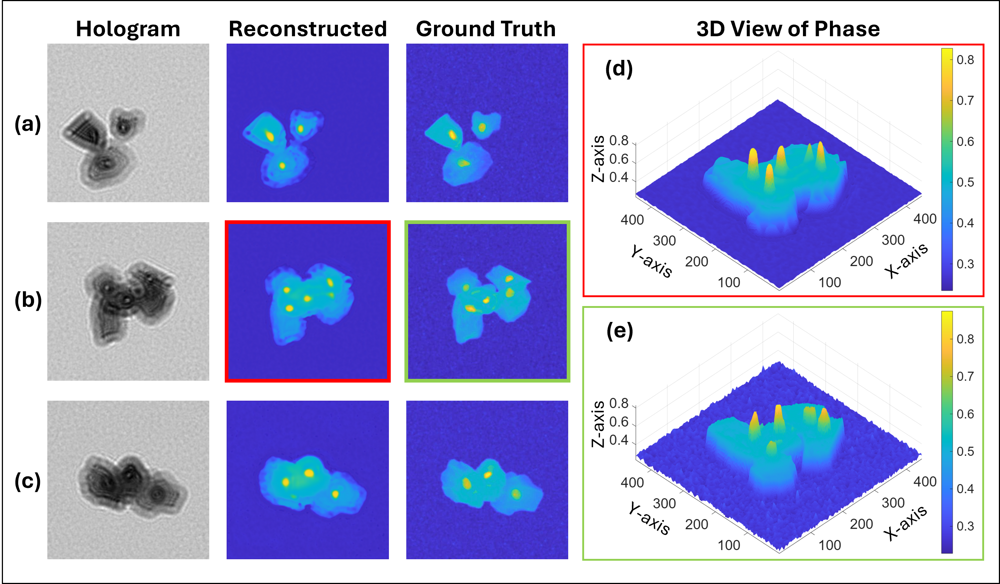

# Weakly-Supervised-Image-Translation-Framework
Weakly Supervised Image Translation Framework for Unregistered Paired Microscopy Images:  The proposed framework employs three CNN architectures comprising: a UNet generator, a PatchGAN discriminator, and a Siamese similarity network, all trained jointly in a loop. 

## Model Architecture


## Results



## Required Libraries

To install the necessary packages for data processing, evaluation, and model training, run the following:

```bash
pip install torch numpy pandas matplotlib tqdm scikit-image pyyaml Pillow
