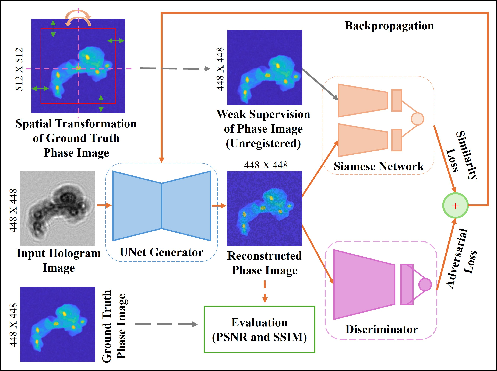
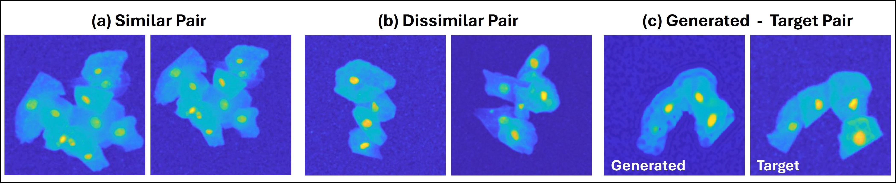
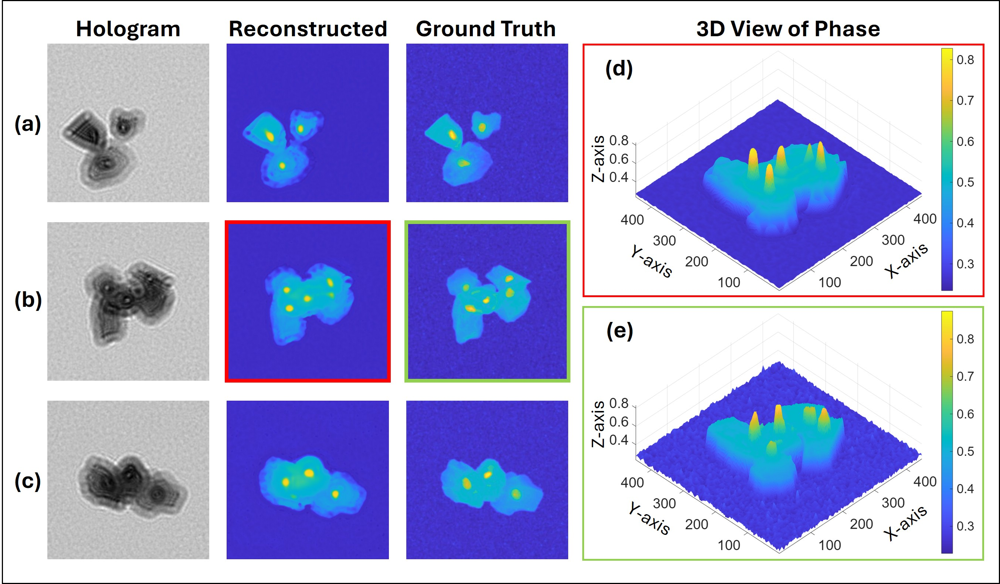

# Weakly Supervised Image Translation Framework for Unregistered Paired Microscopy Images

A deep learning framework for **weakly supervised image-to-image translation** using **paired but spatially unregistered microscopy images**. Unlike conventional supervised methods that require pixel-level registration, the proposed framework learns structural correspondence from weak supervision while preserving the morphological content of the translated images.

---

## Overview

The proposed framework jointly trains three convolutional neural networks:

- **UNet Generator** – Translates source-domain hologram images into reconstructed phase images.
- **PatchGAN Discriminator** – Provides adversarial supervision to encourage realistic target-domain reconstructions.
- **Siamese Similarity Network** – Learns structural similarity between translated outputs and corresponding unregistered target images, providing weak supervisory guidance without requiring pixel-level alignment.

The generator is optimized using a combination of adversarial and similarity losses, enabling image translation from paired but unregistered datasets.

---

## Model Architecture

**Figure 1.** Overall training and evaluation pipeline of the proposed **Weakly Supervised Image Translation Framework**. The input hologram image is translated by the **UNet Generator** into a reconstructed phase image. During training, the reconstructed output is simultaneously processed by a **PatchGAN Discriminator**, which provides adversarial supervision, and a **Siamese Similarity Network**, which compares it with a spatially transformed (unregistered) ground-truth phase image to compute a structural similarity loss. These losses are jointly backpropagated to optimize the generator. During evaluation, the reconstructed phase image is compared with the original registered ground truth using **PSNR** and **SSIM** metrics.

---

## Siamese Network Training

**Figure 2.** Three types of target-domain image pairs used to train the Siamese similarity network.

- **(a) Similar Pair (label = 1):** Images of the same scene differing only by spatial transformations (stretching, cropping, rotation, and resizing).
- **(b) Dissimilar Pair (label = 0):** Images sampled from entirely different scenes.
- **(c) Generated–Target Pair (label = 0):** Generator output paired with the corresponding spatially transformed target image. This pair enables the Siamese network to provide a weak supervisory signal for generator optimization.

---

## Reconstruction Results

**Figure 3.** Qualitative comparison between reconstructed phase images and the corresponding ground truth. The proposed framework successfully reconstructs structural details despite training with spatially unregistered image pairs. The right side panel present the corresponding **3D phase representations** of both the reconstructed output and the ground-truth phase image.

---

## Features

- Weakly supervised image translation
- Supports paired but unregistered datasets
- Joint optimization of Generator, Discriminator, and Siamese Network
- PatchGAN adversarial learning
- Structural similarity-based weak supervision
- Implemented using PyTorch
- Suitable for microscopy and biomedical image translation tasks

---
